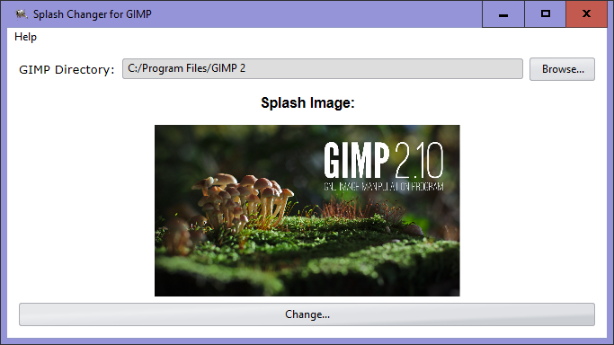

<h1 align="center">
  
</h1>

<h2 align="center"><b>Splash Changer for GIMP</b></h2>

<h1 align="center">
  </a>  
</h1>

<h1 align="center">
  <a href="https://girkovarpa.itch.io/splash-changer-for-gimp#download">
  👉 Download for Windows 👈</a>
</h1>